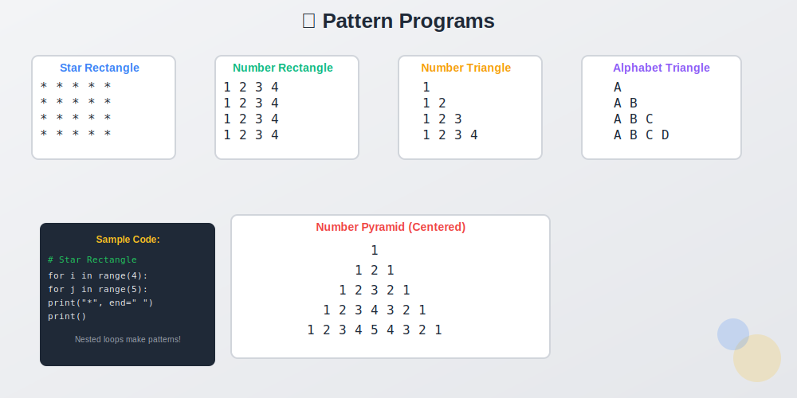
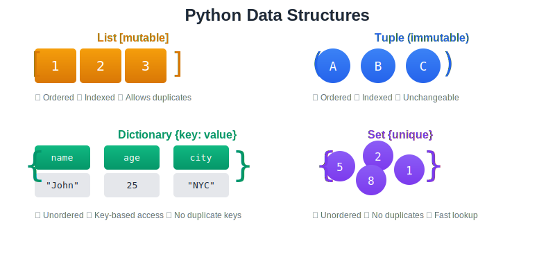

<div align="center">


# Python Programming — From Zero to Hero 🐍🚀

**A structured, topic-wise collection of Python programs covering fundamentals, data structures & problem-solving**

[](https://www.python.org/)
[](#-repository-structure)
[](#-topics--programs-at-a-glance)
[](https://github.com/)

Every program is **well-commented** with clear explanations — learn the _what_, the _why_, and the _how_.

[Explore Topics](#-topics--programs-at-a-glance) · [Get Started](#-getting-started) · [Resources](#-additional-resources) · [Contribute](#-contributing)

</div>

---

## 📌 Highlights

| | Feature |
|---|---|
| 📘 | **8 topic modules** — from Hello World to strings & data structures |
| 🧩 | **30+ programs** — each solving a specific problem with clean, readable code |
| 💬 | **Commented code** — inline explanations for every key concept |
| 🔷 | **5 pattern programs** — star rectangles, number pyramids, alphabet triangles & more |
| 📦 | **Data structures** — lists, tuples, dictionaries & sets with full CRUD operations |
| 📝 | **Cheatsheets** — offline Python cheatsheet for quick revision |

---

<div align="center">


</div>

---

## 📂 Repository Structure

```
Python/
├── basic/                              # Module 1 — Python Fundamentals
│   ├── hello.py                        # First program — printing output & input
│   ├── sum.py                          # Sum of two numbers
│   ├── average.py                      # Average of two numbers
│   ├── square.py                       # Area of a square
│   └── tf.py                           # Comparing two values (True/False)
│
├── string/                             # Module 2 — String Manipulation
│   ├── sstring.py                      # Indexing, slicing, upper, lower, replace, format & more
│   └── palindrome.py                   # Check if a string is a palindrome
│
├── dict/                               # Module 3 — Dictionary Operations
│   ├── dict.py                         # CRUD operations on dictionaries
│   └── sumdict.py                      # Sum of dictionary values
│
├── set/                                # Module 4 — Set Operations
│   └── sset.py                         # Set basics (placeholder)
│
├── calculator.py                       # Calculator using match-case (Python 3.10+)
├── checkFourDigitNo.py                 # Check if a number is 4 digits
├── commonelementset.py                 # Find common elements across multiple lists using sets
├── dict.py                             # Dictionary — create, access, update, delete, nested & zip
├── divisible.py                        # Divisibility check (by 3, 5, 15)
├── evenOdd.py                          # Check even or odd
├── forLoop.py                          # For loop — range, step, list iteration
├── greatestNo.py                       # Find greatest of three numbers
├── lengthof string.py                  # String length, type conversion & tuple/list operations
├── llist.py                            # List — CRUD, sort, reverse, slicing, comprehension, nested
├── operators.py                        # Operator examples (placeholder)
├── pattern.py                          # Pattern printing — rectangle, triangle, pyramid, alphabet
├── percentage.py                       # Grade calculator from percentage
├── positive.py                         # Check positive, negative, or zero
├── profitLoss.py                       # Profit & loss calculator
├── ttuple.py                           # Tuple — access, traverse, concatenate, unpack, reverse
├── whileLoop.py                        # While loop examples
│
├── Python CheatSheet _ CodeWithHarry.html  # Comprehensive Python cheatsheet (offline)
├── assets/                             # SVG images and graphics
└── README.md
```

---

## 🎯 Topics & Programs at a Glance

### 1️⃣ Python Basics

| Program | Concept Covered | Key Takeaway |
|---------|:---------------:|:------------:|
| `hello.py` | Output, input & variables | `print()`, `input()`, `type()`, `id()` |
| `sum.py` | Arithmetic operations | Adding two numbers with `input()` |
| `average.py` | Average calculation | Float input & basic math |
| `square.py` | Area of a square | Exponent operator `**` |
| `tf.py` | Comparison | Boolean result from comparing values |

### 2️⃣ Conditionals & Logic

| Program | Description | Concept |
|---------|:-----------:|:-------:|
| `evenOdd.py` | Check if a number is even or odd | `if-else`, modulo `%` |
| `positive.py` | Check positive, negative, or zero | `if-elif-else` |
| `checkFourDigitNo.py` | Validate 4-digit number | Range checking with `and` |
| `divisible.py` | Divisibility by 3, 5, and 15 | Nested `if-elif-else` |
| `percentage.py` | Grade from percentage | Multi-branch conditionals |
| `profitLoss.py` | Profit & loss calculator | Float input & comparison |
| `greatestNo.py` | Greatest of three numbers | Multiple conditions |
| `calculator.py` | Calculator (+, −, ×, ÷) | `match-case` (Python 3.10+) |

### 3️⃣ Loops & Iteration

| Program | Description | Concept |
|---------|:-----------:|:-------:|
| `forLoop.py` | Range with start, end & step | `for` loop, `range()`, list iteration |
| `whileLoop.py` | Counting with while | `while` loop |

---

<div align="center">



</div>

---

### 4️⃣ Pattern Printing

| Pattern | Description | Visual |
|---------|:-----------:|:------:|
| Star Rectangle | Solid rectangle of stars | `*****` |
| Number Rectangle | Numbers in a grid | `1 2 3 4` |
| Number Triangle | Right-angled number triangle | `1 · 1 2 · 1 2 3` |
| Alphabet Triangle | Right-angled alphabet triangle | `A · A B · A B C` |
| Number Pyramid | Centered number pyramid | `··1·· · 123 · 12345` |

---

<div align="center">



</div>

---

### 5️⃣ Lists

| Program | Description | Operations |
|---------|:-----------:|:----------:|
| `llist.py` | Comprehensive list operations | Create, access, slice, append, insert, extend, remove, pop, update, sort, reverse, list comprehension, copy, concatenate, nested lists |

### 6️⃣ Tuples

| Program | Description | Operations |
|---------|:-----------:|:----------:|
| `ttuple.py` | Comprehensive tuple operations | Create, type check, access, negative indexing, slicing, membership test, traverse, concatenate, unpack, reverse |

### 7️⃣ Dictionaries

| Program | Description | Operations |
|---------|:-----------:|:----------:|
| `dict.py` | Full dictionary CRUD | Create, access, `get()`, update, add, `pop()`, `popitem()`, `clear()`, loop, `items()`, nested dict, `zip()` |
| `sumdict.py` | Sum of dictionary values | Defining expected I/O |

### 8️⃣ Sets & Strings

| Program | Description | Technique |
|---------|:-----------:|:---------:|
| `commonelementset.py` | Common elements across 3 lists | `set()`, `intersection()` |
| `sstring.py` | String indexing, slicing & methods | `find()`, `upper()`, `lower()`, `strip()`, `replace()`, `format()` |
| `palindrome.py` | Palindrome check | Slicing `[::-1]` & function approach |
| `lengthof string.py` | String length & type conversion | `len()`, `type()`, `int()`, `str()` |

---

## 📊 Concepts Quick Reference

| Concept | Python Syntax | Example |
|---------|:-------------:|:-------:|
| Print output | `print()` | `print("Hello")` |
| User input | `input()` | `x = input("Enter: ")` |
| Type casting | `int()`, `float()`, `str()` | `int("42")` → `42` |
| String slicing | `str[start:end:step]` | `"hello"[::-1]` → `"olleh"` |
| List comprehension | `[expr for x in list if cond]` | `[x for x in l if x > 5]` |
| Dictionary access | `dict[key]` / `dict.get(key)` | `phone["gagan"]` |
| Set intersection | `s1.intersection(s2)` | Common elements |
| Match-case | `match` / `case` | Pattern matching (3.10+) |
| Tuple unpacking | `a, b, c = tuple` | Assign to multiple vars |
| For loop range | `range(start, end, step)` | `range(1, 11, 2)` |

---

## 🚀 Getting Started

### Prerequisites

- **Python** 3.10+ — [Download](https://www.python.org/downloads/)
  - Python 3.10+ required for `match-case` in `calculator.py`
  - Python 3.6+ works for all other programs
- Any IDE or text editor (VS Code, PyCharm, IDLE)

### Run any program

```bash
# Navigate to the topic folder
cd basic

# Run
python hello.py
```

### Example output

```
What is your name?
> Kshama
Hello, Kshama !
```

---

## 🧠 How This Repo Is Organized

Each topic is in its own folder. Programs follow a simple, beginner-friendly style:

```python
# Step-by-step logic with inline comments

# Take input from user
num = int(input("Enter a number: "))

# Process
if num % 2 == 0:
    print("Even Number")
else:
    print("Odd Number")
```

> **Tip:** Read the comments inside each file — they explain the logic, edge cases, and alternative approaches.

---

## 📖 Additional Resources

| Resource | Description |
|----------|-------------|
| `Python CheatSheet _ CodeWithHarry.html` | Comprehensive Python cheatsheet (offline HTML) |

---

<div align="center">


</div>

---

## 🗺️ Learning Roadmap

```
Start Here
    │
    ▼
┌───────────┐    ┌───────────────┐    ┌────────────┐
│  basic/   │───▶│ Conditionals  │───▶│  Loops     │
│ Syntax,   │    │ if-else,      │    │ for, while │
│ I/O, Vars │    │ match-case    │    │ range()    │
└───────────┘    └───────────────┘    └────────────┘
                                            │
                                            ▼
┌───────────┐    ┌───────────────┐    ┌────────────┐
│  string/  │◀───│  Data Structs │◀───│  pattern/  │
│ Slicing,  │    │ List, Tuple,  │    │  Nested    │
│ Methods   │    │ Dict, Set     │    │  Loops     │
└───────────┘    └───────────────┘    └────────────┘
```

---

## 🤝 Contributing

Contributions are welcome! Here's how you can help:

1. **Fork** the repository
2. **Create** a feature branch — `git checkout -b feature/new-program`
3. **Commit** your changes — `git commit -m "Add: Program Name"`
4. **Push** to the branch — `git push origin feature/new-program`
5. **Open** a Pull Request

> Please follow the existing code style — add comments, use `input()` for user interaction, and keep one program per file.

---

## ⭐ Show Your Support

If this repository helped you learn Python, give it a **star** ⭐ — it motivates more content!

---

<div align="center">


<sub>Built with ❤️ for the Python learning community</sub>

</div>
